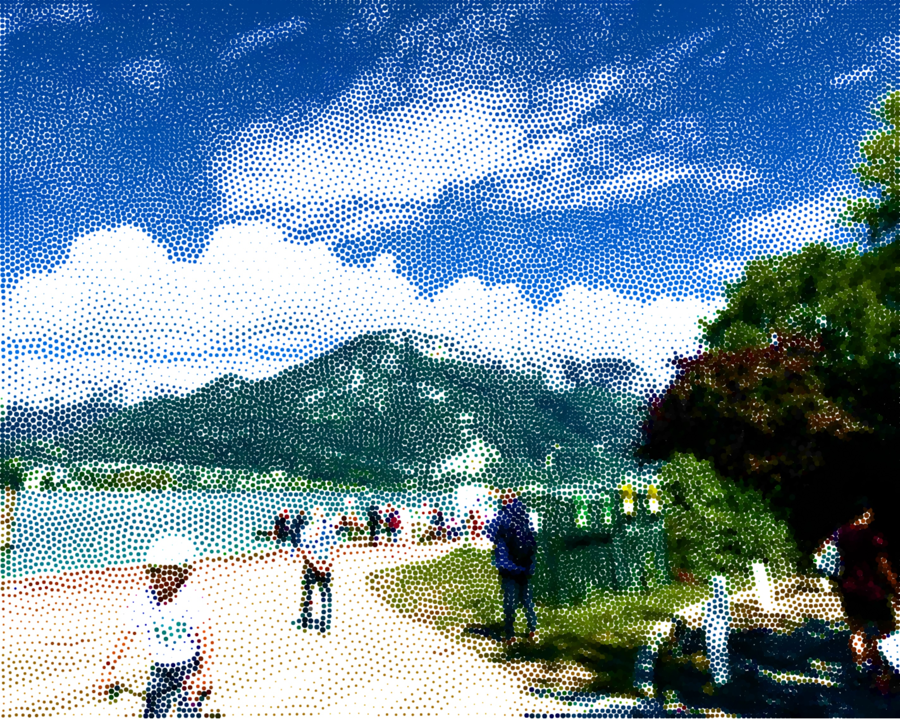

# Image Stippler

Draws dots, performs Lloyd's algorithm / Voronoi relaxation to distribute them,
and performs some heuristic / saturation-increasing coloring over the dots'
areas.

An example from a lake near Geneva:

